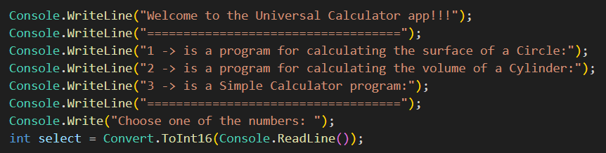

> # Calculator V2

This project is **version 2** of the Calculator project and is a console application. In addition to this project, a program for calculating the surface of a circle and calculating the volume of a cylinder was added. That's why I named this project ***Universal Calculator***  

Have a look at ```Program.cs``` file and you can see how I have used:

## The Universal Calculator project consists of the following sections

1. Input/output=>





2. Section for Circle Area Calculator =>


3. Section for Cylinder volume calculator =>


4. Section Simple Calculator => 


5. Result =>


